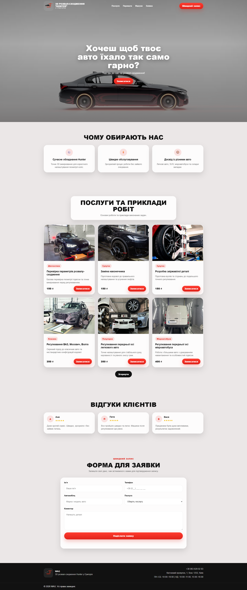

## Preview

  

# WAG — Landing Page for 3D Wheel Alignment (Hunter)

A modern landing page for an auto service specializing in 3D wheel alignment using Hunter equipment.  
The project is focused on attracting clients and enabling quick online booking.

---

## Project Overview

This website is built as a single-page landing with a clear structure and a strong focus on conversion.  
The main goal is to present services, build trust through reviews, and guide the user to the booking form.

---

## Key Features

- Fullscreen hero section with video background
- Fully responsive design for all devices
- Burger menu for mobile navigation
- Services section with cards and real work examples
- Customer reviews section
- Booking form with basic validation
- Automatic service selection in the form
- Smooth scrolling between sections
- Scroll-based animations
- "Load more" button for additional services

---

## Page Structure

Hero (video)  
Benefits  
Services and work examples  
Customer reviews  
Booking form  
Footer  

---

## Technologies

- HTML5
- CSS3 (Flexbox, Grid, responsive layout)
- JavaScript (Vanilla)

---

## Implementation Details

Hero Section:
- Video covers the entire screen
- Uses `object-fit: cover`
- Overlay added for better text readability

Services:
- Cards with fixed image height
- Consistent grid regardless of image proportions
- "Book" button passes selected service into the form

Reviews:
- Card-based layout
- Visual star ratings

Form:
- Required fields validation
- Simulated submission
- Success message after submission

Interactions:
- IntersectionObserver for scroll animations
- Smooth scrolling
- Responsive burger menu

---

## File Structure

/video  
  /images  
  bg.mp4  

index.html  
style.css  
script.js  

---

## Getting Started

Clone the repository:

git clone https://github.com/ArtemShabunevych/A-landing-website-for-gangway-sway-Part-2

Open:

index.html

---

## Purpose

This project is designed as:
- a commercial landing page for an auto service
- a demonstration of frontend development skills
- a base for further scaling and integration

---

## Possible Improvements

- Backend integration for real form submissions
- CRM integration
- Analytics (Google Analytics or similar)
- SEO optimization
- Video optimization (lazy loading, compression)

---

## Author

Artem Shabunevych  
https://github.com/ArtemShabunevych

---

## Conclusion

This project represents a production-ready landing page that can be used as-is or extended for real business needs.
